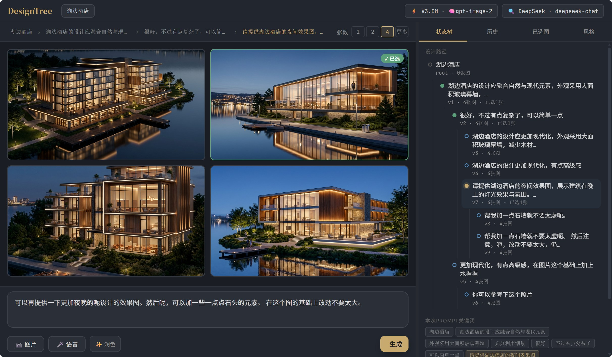

# ArchAgent — 建筑设计 AI 生成工作台

一个专为建筑设计打造的 AI 图像生成工具，支持设计状态树管理、多平台模型切换、风格偏好学习等功能。



## 功能特性

- **设计状态树**：可视化设计迭代路径，支持回退、分支、节点切换
- **多平台支持**：OpenAI、OpenRouter、V3.CM、火山引擎、DeepSeek
- **多模型选择**：gptimage2、gpt-image-1、BananaPro、Gemini 等图像/文本模型
- **风格偏好学习**：自动从选图中学习风格偏好，智能推荐风格标签
- **附带图片上传**：支持拖拽上传参考图片，与提示词一起提交
- **语音输入**：实时语音转文字，自动追加到输入框
- **多主题切换**：暗色、浅色、午夜、傍晚四种主题
- **状态持久化**：刷新页面不丢失输入、风格选择、标签页状态

## 快速启动

```bash
# 1. 安装依赖
pip install -r requirements.txt

# 2. 启动服务
python server.py

# 3. 浏览器打开
http://localhost:8000
```

## 配置 API Key

两种方式任选其一：

**方式1：环境变量**
```bash
export OPENAI_API_KEY=sk-...
python server.py
```

**方式2：启动后在界面设置**
打开 http://localhost:8000，点击右上角「设置」按钮，在各平台输入对应的 API Key。

---

## 使用说明

### 设计流程

1. 输入建筑设计需求（如"现代风格商业建筑，玻璃幕墙，自然采光"）
2. 选择生成数量（1/2/4张）
3. 点击「生成」按钮，等待图片生成
4. 点击图片选中满意的方案
5. 继续输入修改需求，基于选中图片迭代优化

### 状态树面板

左侧面板显示设计迭代路径：
- **设计路径**：可视化树结构，点击节点可回退查看历史
- **本次prompt关键词**：当前路径的关键词标签
- **附带图片**：当前节点上传的参考图片

### 风格面板

系统自动学习风格偏好：
- 点击风格标签勾选/取消
- 选择自动应用（防抖处理）
- 未勾选的风格会被降权

### 已选图

右侧底部显示所有已选图片：
- 点击放大镜查看大图
- 已选图片会作为下一轮生成的参考

---

## 文件结构

```
ArchAgent/
├── state_manager.py   # 设计状态树（核心逻辑）
├── agent.py           # AI调用：prompt优化 / 图像生成 / 语音转文字
├── server.py          # FastAPI后端
├── requirements.txt   # Python依赖
├── config.json        # API Key（自动生成）
├── sessions/          # 会话JSON文件（自动保存）
├── static/
│   ├── index.html     # 前端界面
│   └── uploads/       # 生成的图片
└── Readme_image/      # README截图
```

## 状态树逻辑

```
root（初始需求）
 └── v1（用户第一次修改 + 选图）
      └── v2（继续迭代）  ← 当前
      └── v1b（回退后另起分支）
```

**核心原则**：叶子节点生成图片时，prompt = 从 root 到当前节点路径上所有输入的整合 + 已选图片。不会混入其他分支的内容。

## 支持的平台和模型

| 平台 | 图像模型 | 文本模型 |
|------|----------|----------|
| V3.CM | gptimage2, gptimage3 | gpt-4o-mini |
| OpenAI | gpt-image-1, gpt-image-2 | gpt-4o |
| OpenRouter | BananaPro, Gemini | Claude, Gemini |
| 火山引擎 | volcengine-image | - |
| DeepSeek | - | deepseek-chat |

## 依赖的API

| 功能 | API |
|------|-----|
| Prompt优化 | GPT-4o-mini / DeepSeek |
| 图像生成 | gptimage2 / OpenAI DALL-E |
| 语音转文字 | Whisper-1 |

## 技术栈

- **后端**：Python + FastAPI
- **前端**：原生 HTML/CSS/JS（无框架）
- **AI**：OpenAI API / OpenRouter API / V3.CM API

---

Made with ❤️ for architects